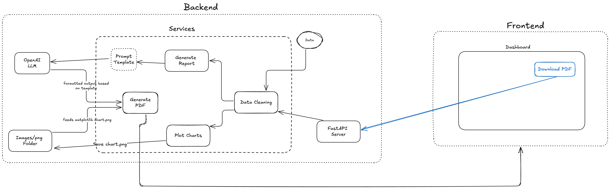

# Process First LLC - Process Analysis Tool

## PDF Service Design



## Project Structure
```
.
├── backend/               # FastAPI backend
│   ├── app/               # Application code
│   │   ├── api/           # API routes
│   │   ├── models/        # Data models
│   │   └── services/      # Business logic services
│   ├── data/              # Sample data
│   ├── output/            # Generated reports and charts
│   ├── main.py            # Application entry point
│   └── requirements.txt   # Python dependencies
└── frontend/              # Frontend application
```

## Development
### Prerequisites
- Python 3.8+
- OpenAI API key (for AI-generated summaries)
- Node.js and npm (for frontend development)

### Setup Guide
Follow these steps to get started:

1. **Install Git**
   - Download Git from https://git-scm.com/downloads
   - Follow the installation wizard with default settings

2. **Clone the Repository**
   ```bash
   # Navigate to your preferred directory
   cd /path/to/your/preferred/location

   # Clone the repository
   git clone git@github.com:[your-username]/process-first-llc.git

   # Navigate into the project directory
   cd process-first-llc
   ```

3. **Verify Installation**
   ```bash
   # Check Git version
   git --version

   # Check repository status
   git status
   ```

### Environment Variables
Create a `.env` file in the root directory with the following variables:
```
OPENAI_API_KEY=your_openai_api_key
```

## Backend

### Getting Started
1. Install the latest version of Python with `brew install python` (install Brew if you haven't already)
2. Create virtual env in `backend` folder with `python3 -m venv venv`
3. Activate venv with `. venv/bin/activate`
4. Install packages with `pip3 install -r requirements.txt`
5. Run `python3 main.py` to run the backend
6. Enter the following in a browser: `http://localhost:8000/docs` to see APIs

### API Routes
The backend provides the following API endpoints:

| Endpoint | Method | Description |
|----------|--------|-------------|
| `/api/process-data` | GET | Returns the full process data |
| `/api/top-impact` | GET | Returns top impact variables affecting the KPI |
| `/api/scenarios` | GET | Returns all scenarios with their KPI values |
| `/api/setpoint-impacts` | GET | Returns setpoint impact summary |
| `/api/generate-report` | GET | Generates a PDF report from the data |
| `/api/download-report` | GET | Downloads the generated PDF report |

### API Documentation

When the server is running, you can access the interactive API documentation at:
- Swagger UI: `http://localhost:8000/docs`

### Keeping Packages Updated
If you install any new packages, run `pip freeze > requirements.txt` to save the latest packages before committing, so others can easily install them.

---

## Frontend
### Getting Started
1. Navigate to the frontend directory: `cd frontend`
2. Install dependencies: `npm install`
3. To start the application, run `npm run dev`
4. Access the appplication at: `http://localhost:5174/`
5. Ensure the backend server is running before using the application

### Feature Checklist

### Node Creation
- [x] Pagination table updates when nodes are added
- [x] Node IDs are unique
- [x] Pagination handles new nodes accordingly by including new pages

### Node Deletion
- [x] Node deletion functionality
- [x] Table row deletion reflects on Canvas
- [x] Connected edges are deleted when parent node is removed

### Node Modification
- [x] Node name edits sync between Canvas & Table
- [x] Node property changes are persisted
- [x] Node type changes are supported

### Edge Creation
- [x] Edge creation disabled when < 2 nodes exist
- [x] Upstream/downstream options show all available nodes
- [x] New edges appear in edge table with correct endpoints
- [x] Pagination handles new edges accordingly by including new pages

### Edge Modification
- [x] Edge endpoint modification (upstream/downstream)
- [x] Edge changes reflect in table & canvas view

### Edge Deletion
- [x] Edge deletion functionality
- [x] Deleted edges remove from both table & canvas

---

## Assumptions
- A node can be connected back to itself
- Strict validations are not needed other than what was mentioned in requirements
- Node colors should be reflected to give indication `type` has changed
- Frontend aspect of task is more important than business-logic analysis, and hence, focus is on frontend and overall UI/UX
- No tests need to be written
- KPI values are important

---

## What I would have done better (if more time)
- Modularise certain API services so there is greater reusability
- Explore more data visualization frontend libraries as the one I was using was limited 
- React 19 is new & therefore, alot of libraries' compatibility has not yet been updated, would have used React 18 earlier on if I had known this
- Write some basic unit tests
